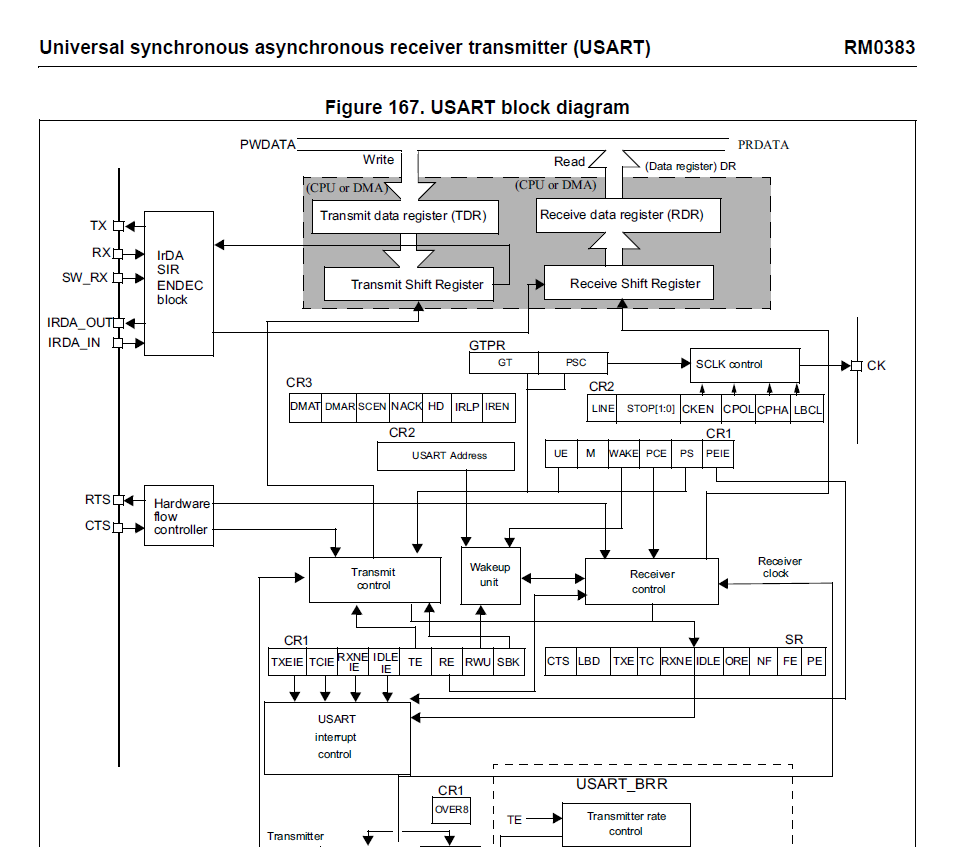

# STM32: Look, ma, no HAL!

## Introduction

I started my embedded journey using STM32 IDE and HAL. It is kind of easy, but HAL hides a lot of details, which might be crucial for understanding how MCU actually works. So I decided to learn how to program without HAL, and document my progress here for future self and also others.

## Prerequisites

You are going to need a devboard, debugger/programmer utility, STM32IDE and your MCU's reference manual.
I am using some chineese knock off Black Pill devboard with F411 MCU, WeAct Mini Debugger. There are other options.


You might avoid using STM32IDE, but it is more advanced and not strictly necessary for my educational purposes.
With STM32IDE it is also way easier to fing reference manual for your MCU.

## Creating a blank project

Launch STM32IDE (I am using 1.12.0). Select File-New-STM32 Project.
Find the MCU that's on your devboard, select it, mark with a star so it would be easier to find it next time around.
Go to Docs&Resources, find reference manual, save it.
Click next, give your project a name, in "Targeted Project Type" select Empty. If you don't select Empty, HAL library will be linked and a lot of HAL initialization code will be generated.
Click Finish and the project is created with some files, we're interested only in main.c file right now.

## Blinking an LED

## Writing to a UART

just a paragraph.

`a peice of code`

```
long
piece
of code
```


