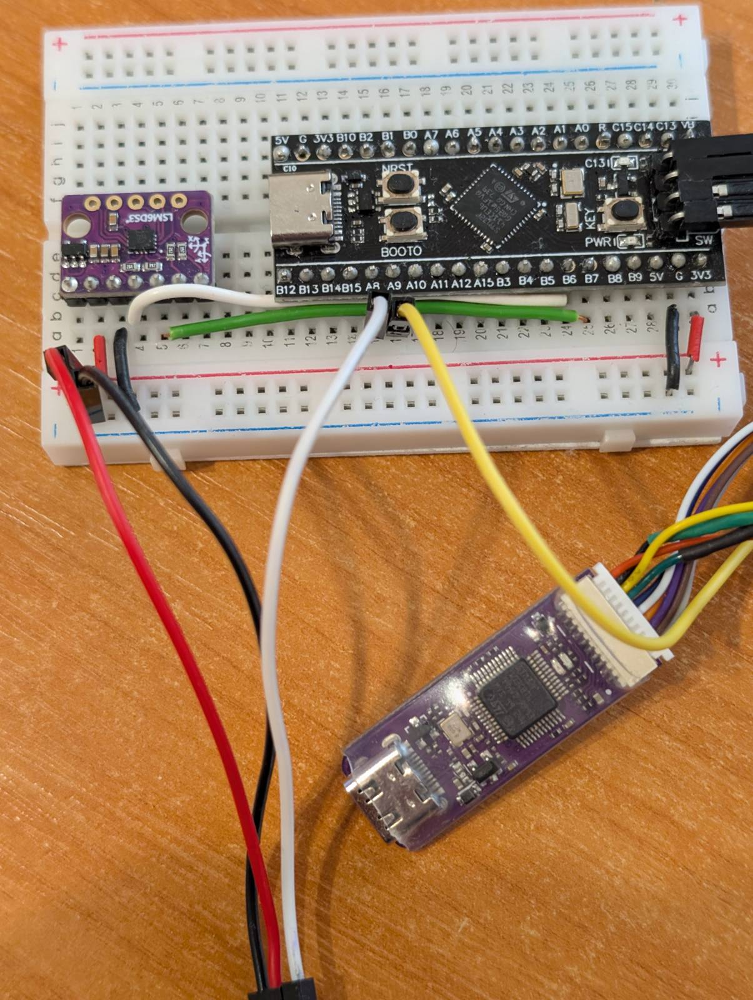

# STM32: Look, ma, no HAL!

## Introduction

I started my embedded journey using STM32 IDE and HAL. It is kind of easy, but HAL hides a lot of details, which might be crucial for understanding how MCU actually works. So I decided to learn how to program without HAL, and document my progress here for future self and also others.

## Prerequisites

You are going to need a devboard, debugger/programmer utility, STM32IDE and your MCU's reference manual.
I am using some chinese knock off Black Pill devboard with F411 MCU, WeAct Mini Debugger. There are other options.

You might avoid using STM32IDE, but it is more advanced and not strictly necessary for my educational purposes.
With STM32IDE it is also way easier to find reference manual for your MCU.

## Creating a blank project

Launch STM32IDE (I am using 1.12.0). Select File-New-STM32 Project.
Find the MCU that's on your devboard, select it, mark it with a star so it would be easier to find it next time around.
Go to Docs&Resources, find the reference manual, save it.
Click next, give your project a name, in "Targeted Project Type" select Empty. If you don't select Empty, HAL library will be linked and a lot of HAL initialization code will be generated.
Click Finish and the project is created with some files, we're interested only in the main.c file right now.

## Blinking an LED

On black pill there is an LED present on the board itself, that's what I am going to use. You can connect an external LED if you want.
Mine is connected to the C13 pin on the MCU, so to control it I am going to use GPIOC pin 13.

By default GPIOC is inactive (as most peripherals) and we need to switch it on.
This can be done via RCC (reset and clock control). On F411 there is a register RCC_AHB1ENR, which controls whether clock is enabled to specific peripherals. To enable GPIOC you need to set bit GPIOCEN (bit 2 counting from 0) to 1. (Read reference manual for other MCUs.)

Next we need to switch GPIOC pin 13 into output mode. For that we will use register GPIOx_MODER (x=A,B,C...). Using this register we can choose mode for a given pin: input (default, reset state), output, alternate function, analog. For pin 13 we need to set bits 26 and 27 to 01 - output. (Read reference manual for other MCUs.)

Now we can use the register GPIOx_BSSR to set/reset value to pin 13. If you write 1 to the first 16 bits - this would set the corresponding pin. If you write 1 to bit 16-31 - this would reset value to pin (bit number) - 16. So now if we want to light up LED on pin C13 - we need to write 1 to GPIOx_BSSR bit 13. To turn the LED off we need to write 1 to GPIOx_BSSR bit (13 + 16). (Read reference manual for other MCUs.)

## Writing to a UART

Not yet written.
